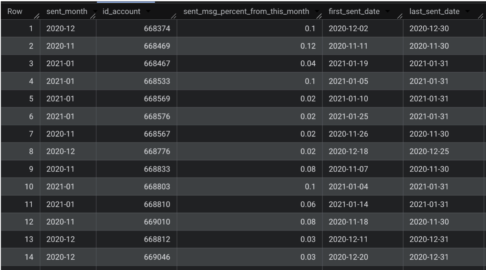

# Email Sending View Analysis

## Overview

This project demonstrates the creation and use of a SQL view for analyzing monthly email sending activity by account.

The view aggregates email sending data by month and account, calculates each account's contribution to the monthly total, and identifies the first and last email sending dates.

## Analysis

The SQL script consists of two parts:

1. Creating the `Students.v_Bobko_Aggregation` view with monthly email sending metrics.
2. Querying the created view to retrieve the resulting data.

The view calculates:

* Monthly email sending activity by account
* Each account's percentage contribution to the monthly total
* First email sending date for each account within a month
* Last email sending date for each account within a month

## Technologies

* SQL
* Google BigQuery

## Query Result

The following screenshot shows the result of querying the created view in Google BigQuery.

